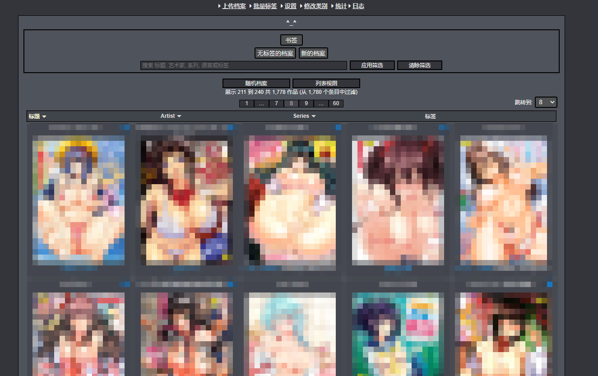
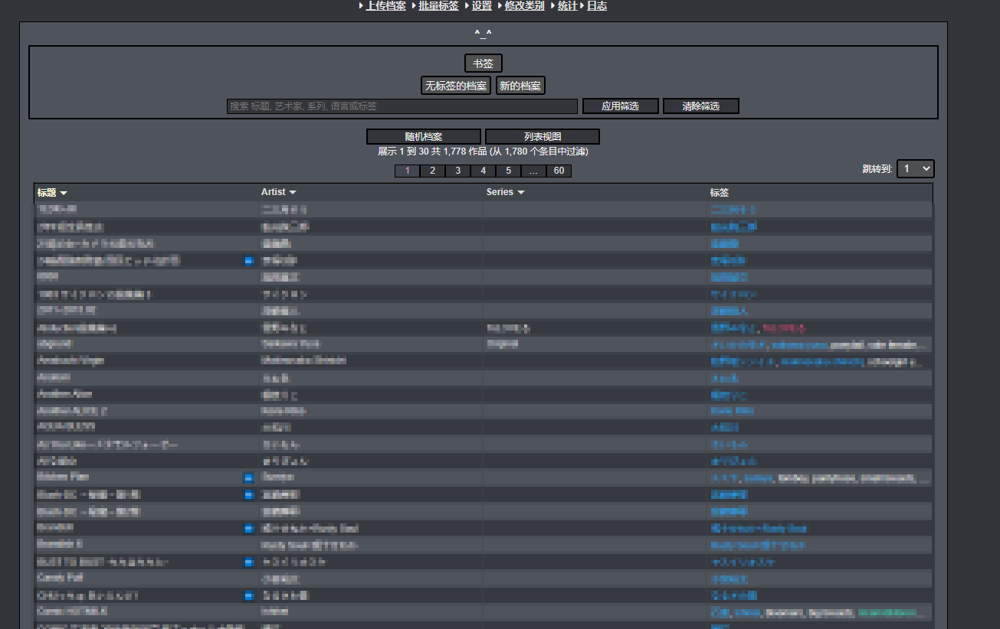
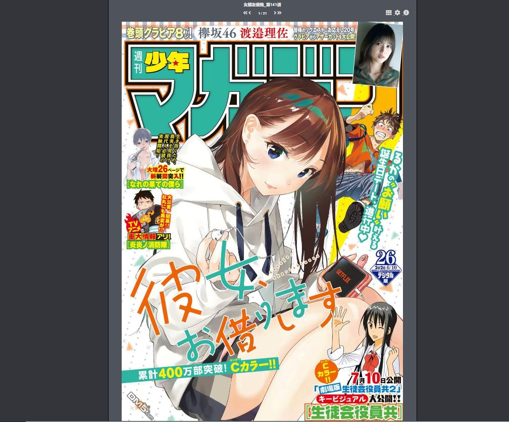
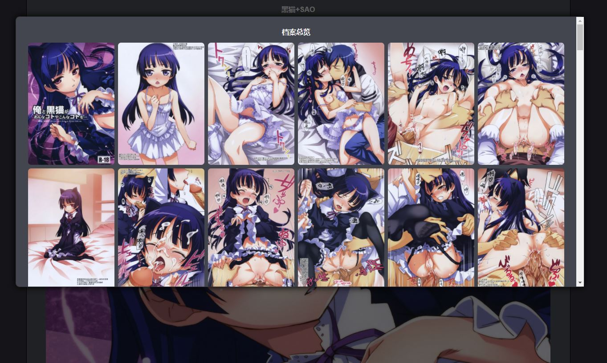
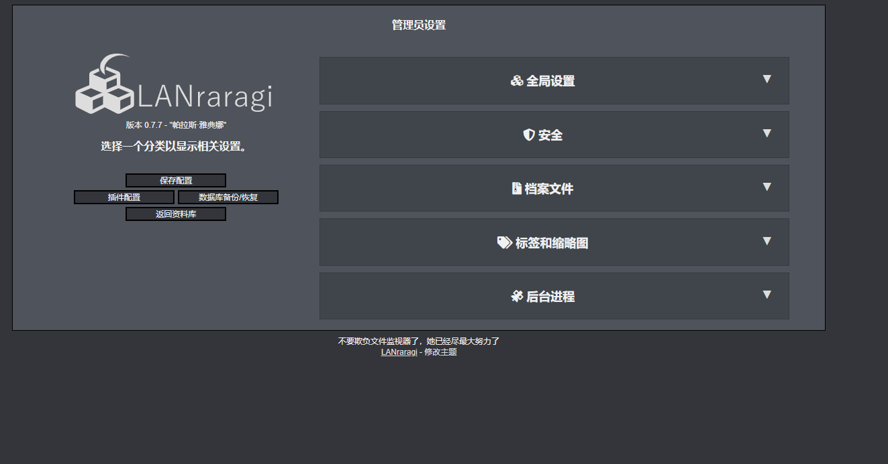
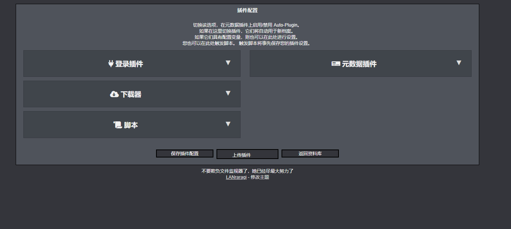

LANraragi_cn
This repo is a fork of Difegue / LANraragi , those things i've done was to translate this repo into chinese ,and fix chrome browser js problem .also use user root instead of user koyomi to fix the access permissions of the content folder.

also i've build a docker image , if you are a user of docker ,you need to mount your comic folder to "/root/lanraragi/content" directory, and the database folder to "/root/lanraragi/database" directory.

这是LANraragi的汉化版本，相较与原版汉化了界面，修复了chrome的js报错，并且使用root账户代替koyomi解决群晖nas上面的无法访问挂载文件夹/home/koyomi/lanraragi/content目录的问题,我构建了一个docker镜像，如果你是docker用户，你需要将漫画文件夹挂载到/root/lanraragi/content，数据库挂载到/root/lanraragi/database。

## 截图  
 
|主页, 预览图 | 主页, 列表模式 |
|---|---|
|  |  |

|阅读器 | 预览 |
|---|---|
|  |  |

|配置 | 插件配置 |
|---|---|
|  |  |
